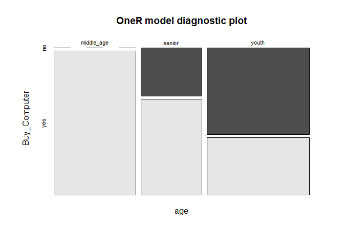

# OneR  

[](https://GitHub.com/Naereen/) 

### Load Library

Library yang dibutuhkan adalah **oneR**. Silahkan install terlebih
dahulu jika belum terisntall, dengan perintah `install.packages("oneR")`

``` r
library(OneR)
```

### Baca Data

Data tersimpan di folder `dataset`

``` r
data <- read.csv("../dataset/beli_komputer.csv", header = T, sep = ";")
data <- data[, 2:6]
head(data)
```

    ##          age income student credit_rating Buy_Computer
    ## 1      youth   high      no          fair           no
    ## 2      youth   high      no     excellent           no
    ## 3 middle_age   high      no          fair          yes
    ## 4     senior medium      no          fair          yes
    ## 5     senior    low     yes          fair          yes
    ## 6     senior    low     yes     excellent           no

### Explorasi Data

#### Melihat struktur data

``` r
str(data)
```

    ## 'data.frame':    14 obs. of  5 variables:
    ##  $ age          : chr  "youth" "youth" "middle_age" "senior" ...
    ##  $ income       : chr  "high" "high" "high" "medium" ...
    ##  $ student      : chr  "no" "no" "no" "no" ...
    ##  $ credit_rating: chr  "fair" "excellent" "fair" "fair" ...
    ##  $ Buy_Computer : chr  "no" "no" "yes" "yes" ...

#### Melihat apa terdapat data yang miss

``` r
colSums(is.na(data))
```

    ##           age        income       student credit_rating  Buy_Computer 
    ##             0             0             0             0             0

#### Mengubah tipe variabel menjadi factor

``` r
for(i in names(data[-1])){
  data[ ,i] <- as.factor(data[ ,i])
}
summary(data)
```

    ##      age               income  student   credit_rating Buy_Computer
    ##  Length:14          high  :4   no :7   excellent:6     no :5       
    ##  Class :character   low   :4   yes:7   fair     :8     yes:9       
    ##  Mode  :character   medium:6

### Split Data

Memecah data menjadi data training(80% dari data awal) dan data test
(20% dari data awal)

``` r
set.seed(1234)
sampel<-sample(2,nrow(data),replace = T, prob = c(0.8,0.2))
trainingdat<-data[sampel==1, ]
testingdat<-data[sampel==2, ]
print(paste("Jumlah Train Data: ", nrow(trainingdat), "| Jumlah Test Data: ", nrow(testingdat)))
```

    ## [1] "Jumlah Train Data:  12 | Jumlah Test Data:  2"

### Membuat Model

``` r
model.OneR <- OneR(Buy_Computer~., data = trainingdat, verbose = TRUE)
```

    ## 
    ##     Attribute     Accuracy
    ## 1 * age           75%     
    ## 2   income        66.67%  
    ## 2   student       66.67%  
    ## 2   credit_rating 66.67%  
    ## ---
    ## Chosen attribute due to accuracy
    ## and ties method (if applicable): '*'

``` r
summary(model.OneR)
```

    ## 
    ## Call:
    ## OneR.formula(formula = Buy_Computer ~ ., data = trainingdat, 
    ##     verbose = TRUE)
    ## 
    ## Rules:
    ## If age = middle_age then Buy_Computer = yes
    ## If age = senior     then Buy_Computer = yes
    ## If age = youth      then Buy_Computer = no
    ## 
    ## Accuracy:
    ## 9 of 12 instances classified correctly (75%)
    ## 
    ## Contingency table:
    ##             age
    ## Buy_Computer middle_age senior youth Sum
    ##          no           0      1   * 3   4
    ##          yes        * 4    * 2     2   8
    ##          Sum          4      3     5  12
    ## ---
    ## Maximum in each column: '*'
    ## 
    ## Pearson's Chi-squared test:
    ## X-squared = 3.6, df = 2, p-value = 0.1653

### OneR Model

``` r
plot(model.OneR)
```

 \#\#\#
Model Evaluation

``` r
pc <- predict(model.OneR, testingdat, type = "class")
eval_model(pc,testingdat)
```

    ## 
    ## Confusion matrix (absolute):
    ##           Actual
    ## Prediction no yes Sum
    ##        no   0   0   0
    ##        yes  1   1   2
    ##        Sum  1   1   2
    ## 
    ## Confusion matrix (relative):
    ##           Actual
    ## Prediction  no yes Sum
    ##        no  0.0 0.0 0.0
    ##        yes 0.5 0.5 1.0
    ##        Sum 0.5 0.5 1.0
    ## 
    ## Accuracy:
    ## 0.5 (1/2)
    ## 
    ## Error rate:
    ## 0.5 (1/2)
    ## 
    ## Error rate reduction (vs. base rate):
    ## 0 (p-value = 0.75)
